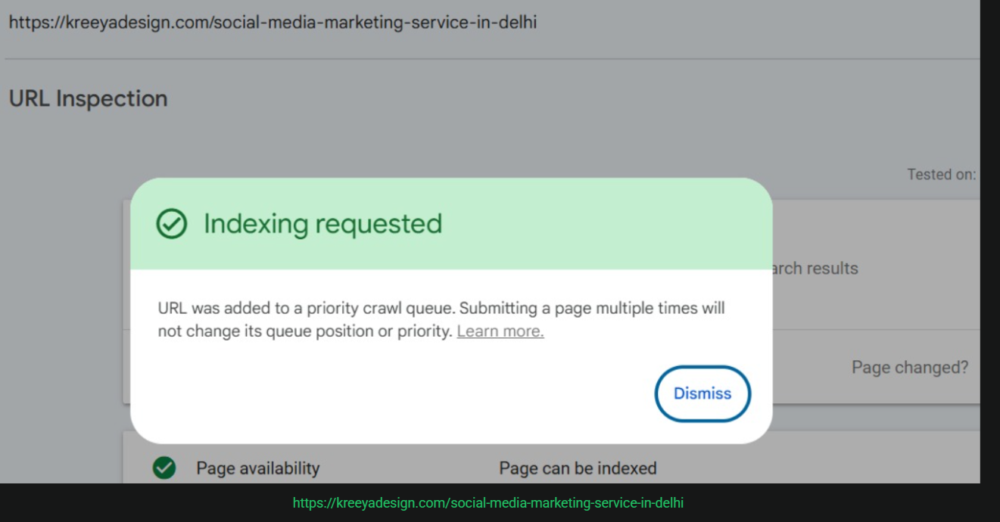
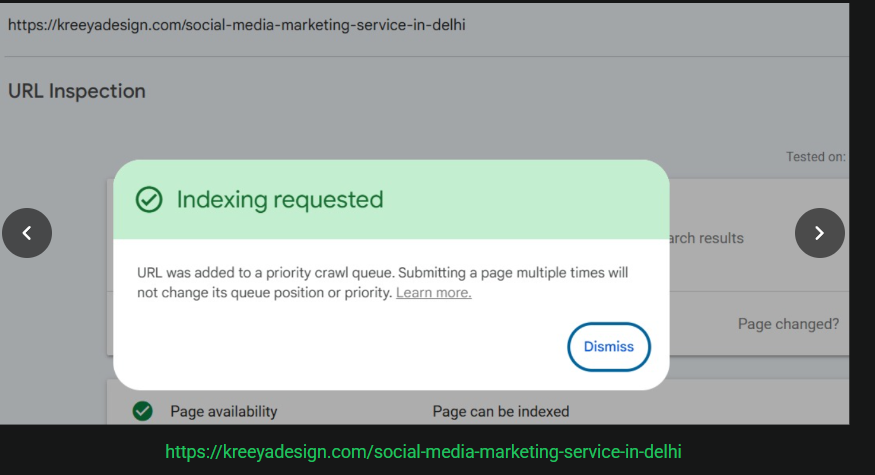
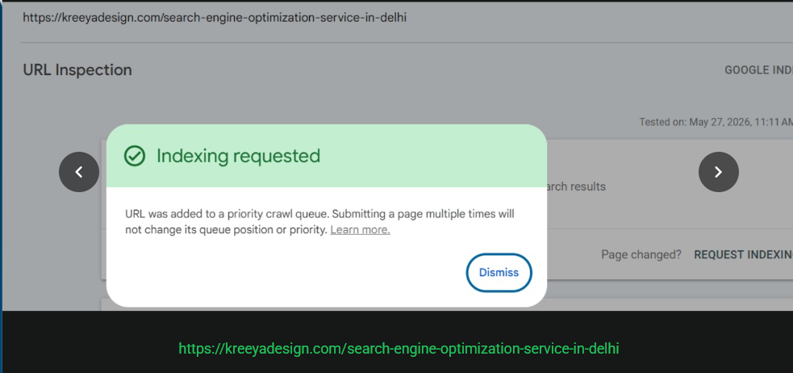

Things to do




Ye services ke items ke page h ye jab seo me dale manager ne to indexing ka issue aa rha h iska kya reason h find kro

---

# 🔍 Indexing Issue Analysis & Solutions / इंडेक्सिंग समस्या का विश्लेषण और समाधान

## 1. Main Reasons for the Indexing Issue / इंडेक्सिंग न होने के मुख्य कारण

### 🔴 A. Client-Side Rendering (CSR) Issue (सबसे बड़ा कारण)
* **English:** The React/Vite app is a Single Page Application (SPA) where pages are rendered entirely client-side. When Googlebot requests a page (e.g., `/social-media-marketing-service-in-delhi`), the server returns an empty `index.html` with a blank `<main id="root"></main>`. The browser then loads the JavaScript, which calls the backend API (`api.kreeyadesign.com/services`) to fetch and display the content.
  * **Why it fails SEO:** Googlebot has a "Two-Pass Indexing" system. It queues JavaScript-heavy pages for rendering, which can take days or weeks. Other search engines (Bing, Yahoo) and social share bots (WhatsApp, Facebook, LinkedIn) **do not run JavaScript at all**, meaning they will only see a completely blank page.
* **Hindi/Hinglish:** App React और Vite (Single Page Application) में बनी है जो पूरी तरह से Client-Side Render (CSR) होती है। जब Googlebot किसी page को request करता है, तो server उसे खाली `index.html` देता है जिसमें सिर्फ `<main id="root"></main>` होता है।
  * **SEO पर असर:** Googlebot JavaScript को render करने के लिए queue में डाल देता है, जिससे indexing में बहुत दिन या हफ्ते लग सकते हैं। दूसरे Search Engines (Bing, Yahoo) और Social Bots (WhatsApp, Facebook) तो JavaScript run ही नहीं करते, इसलिए उन्हें सिर्फ खाली page दिखता है।

---

### 🔴 B. Slug Mismatch Bug in `usePageSEO.js` (कोड में तकनीकी बग)
* **English:** Even if the slugs in the database are perfectly saved in lowercase with dashes (e.g. `social-media-marketing-service-in-delhi`), a match can still fail if the incoming URL has a different case (e.g. `/Social-Media-Marketing-Service-in-Delhi`). 
  * `ItemPage.jsx` normalizes slugs dynamically via `matchesRouteSlug()` (converting to lowercase, etc.), so the page **loads successfully**.
  * However, `usePageSEO.js` (lines 171 & 178) does an exact case-sensitive match: `item.slug === slug`. If a user or crawler visits a link with any uppercase letters, the page will load correctly but **the SEO meta tags will fail to load**, defaulting to the home page or "Not Found" meta tags.
  * **Why it fails SEO:** It creates inconsistent metadata for search engines when URLs are indexed with slight case variations.
* **Hindi/Hinglish:** भले ही database में slug एकदम सही lowercase with dashes (`social-media-marketing-service-in-delhi`) में सेव हो, लेकिन अगर कोई crawler या user URL में Case change कर दे (जैसे `/Social-Media-Marketing-...`), तो issue आएगा।
  * `ItemPage.jsx` URL को lowercase में कन्वर्ट करके render कर देता है, जिससे page तो **सफलतापूर्वक खुल जाता है**।
  * लेकिन `usePageSEO.js` line 171 & 178 पर exact case-sensitive match (`item.slug === slug`) करता है। इसलिए, case-difference होने पर **SEO tags load नहीं होंगे** और default tags चले जाएंगे।
  * **SEO पर असर:** Google में dynamic pages की different cases की वजह से inconsistent metadata जाता है।

---

### 🔴 C. Missing from `sitemap.xml` (साइटमैप में न होना)
* **English:** The `public/sitemap.xml` file only lists static paths like `/about-us` and `/blogs`. Dynamic service items and location URLs are completely missing.
  * **Why it fails SEO:** Search engine bots cannot discover and crawl pages systematically if they are not listed in the sitemap.
* **Hindi/Hinglish:** `public/sitemap.xml` फ़ाइल में सिर्फ static pages (`/about-us`, `/blogs` आदि) लिखे हैं। Dynamic service items और locations के links उसमें मौजूद नहीं हैं।
  * **SEO पर असर:** Crawlers को dynamic pages का पता ही नहीं चलता क्योंकि वे sitemap में नहीं हैं।

---

### 🔴 D. Wildcard Routing and Soft 404s (सॉफ्ट 404 की समस्या)
* **English:** In `App.jsx`, a wildcard `/:itemSlug` is used to capture any path. If a user visits a completely non-existent route, the server returns a `200 OK` status and loads the `404NotFound` component client-side.
  * **Why it fails SEO:** Google flags this as a "Soft 404" because a non-existent URL is returning a success code instead of a true `404 Not Found` HTTP header. This wastes crawl budget and hurts ranking.
* **Hindi/Hinglish:** React router में `/:itemSlug` wildcard route use हुआ है। जब कोई गलत URL पर जाता है तो भी server `200 OK` status return करता है और screen पर React 404 page दिखाता है।
  * **SEO पर असर:** Google इसे "Soft 404" मानता है, जिससे crawl budget बर्बाद होता है और domain authority कम होती है।

---

## 🛠️ Step-by-Step Solutions / समाधान

### 1️⃣ Fix `usePageSEO.js` matching logic (Immediate Code Fix)
* **Action:** Update the slug matching in `user/src/hooks/usePageSEO.js` to match the robust `matchesRouteSlug` logic.
* **Code update in `usePageSEO.js`:**
  Import `matchesRouteSlug` at the top:
  ```javascript
  import { matchesRouteSlug } from "../utils/slug";
  ```
  And replace lines 169-181 with:
  ```javascript
  const locationItem = allLocations
       .flatMap((location) => location.items || [])
       .find((item) => matchesRouteSlug(item, slug));
  if (locationItem) {
       return getItemSeo(locationItem);
  }

  const serviceItem = allServices
       .flatMap((service) => service.items || [])
       .find((item) => matchesRouteSlug(item, slug));
  if (serviceItem) {
       return getItemSeo(serviceItem);
  }
  ```

---

### 2️⃣ Pre-rendering / SSG using Vite Plugin (Best long-term solution for Apache)
* **Action:** Install and configure a pre-rendering tool like `vite-plugin-prerender` (or a static site generator tool).
* **How it works:** During `npm run build`, the prerenderer spins up a headless browser, hits all dynamic pages, gets the API responses, and generates real physical static `.html` files for every route (e.g. `/social-media-marketing-service-in-delhi/index.html`).
* **Why it helps:** Search engines and social share bots will instantly get fully populated HTML content with all correct meta tags pre-rendered.

---

### 3️⃣ Integrate Prerender.io (Easiest & Fastest to setup)
* **Action:** Sign up on **Prerender.io** (free tier supports up to 1,000 pages).
* **Configuration:** Add rules to `.htaccess` to detect crawlers (like Googlebot, Bingbot, Facebot, etc.) and proxy their requests to Prerender.io, while normal human users are served the fast React SPA directly.
* **htaccess configuration addition:**
  ```apache
  <IfModule mod_headers.c>
    # Detect bots and proxy to Prerender.io
    # (Prerender middleware rules go here)
  </IfModule>
  ```

---

### 4️⃣ Dynamically Update `sitemap.xml`
* **Action:** Build a simple server-side script (e.g., node script) that runs after you publish/update service items, fetching all URLs from the backend API and dynamically building/overwriting `sitemap.xml` with the dynamic URLs included.
* **Example Dynamic Entry:**
  ```xml
  <url>
    <loc>https://kreeyadesign.com/social-media-marketing-service-in-delhi</loc>
    <lastmod>2026-05-27</lastmod>
    <changefreq>weekly</changefreq>
    <priority>0.9</priority>
  </url>
  ```
